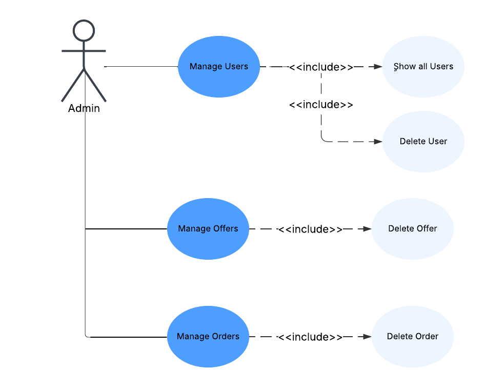

# A5dar definition 
A5dar provides a solution by allowing farmers to create offers for their products, specifying details like quantity, price, unit, category, and description. These offers are visible in the platform’s marketplace, where traders can browse and place orders. Each offer can only be accepted by the farmer once, encouraging fair selection and minimizing transaction complications.

# Functional Requirment 
User login and account management for traders, farmers, and admins.
 • Management of product offers, including the ability to create, update, and delete offers.
 • Order functionality, where traders can place orders on valid offers, and farmers can accept one order per offer.
 • User profiles for all participants, displaying personal information and activities.
 • Product review system, where users can rate and comment on products.
 • Admin panel for managing users, products, and orders.
 • Real-time tracking of orders, including order status and updates.
# Non Functional Requirment 
- The platform should respond to any user interaction
- The system should be able to handle a growing number of users
- All user passwords must be hashed using a strong hashing algorithm
-  All pages and modals across the system should follow a consistent design system with clear button labels, validation messages, and icons
-  The platform should support at least Arabic and English, allowing users from different regions in Egypt and beyond to use the system comfortably
-  The system should support major modern browsers including Google Chrome, Mozilla Firefox, and Microsoft Edge.

# System Actors 
Farmars , Traders , System admins

# Assumptions 
- All users have better internet connection and a browser

# User Use Case ( Farmers and Traders )
.png)

# Admin Use Case

# A5dar ERD
.pdf)

